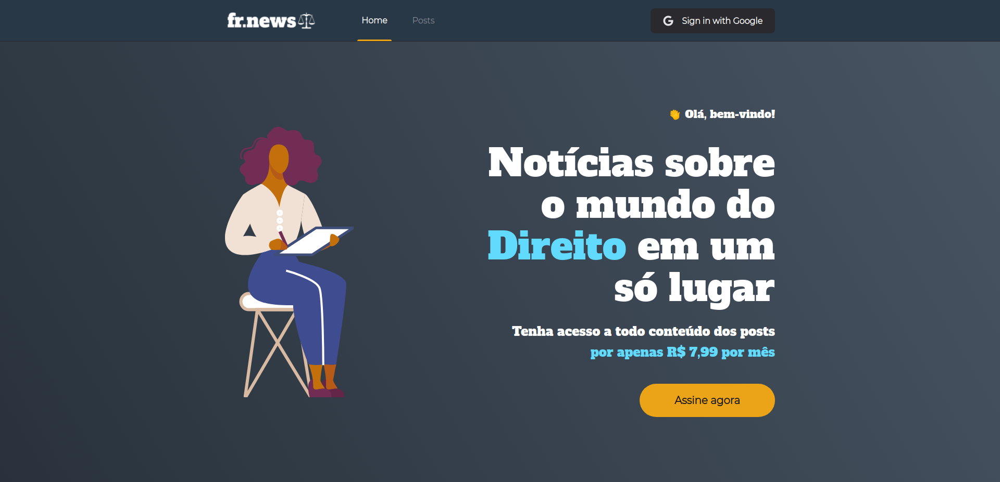
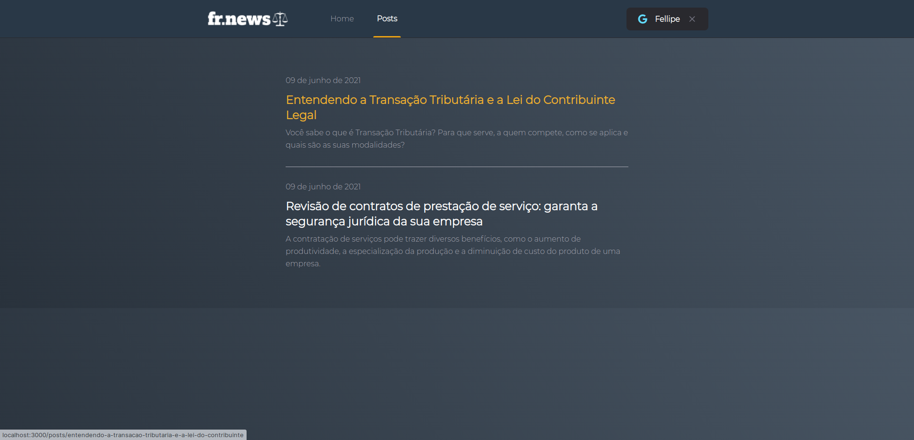
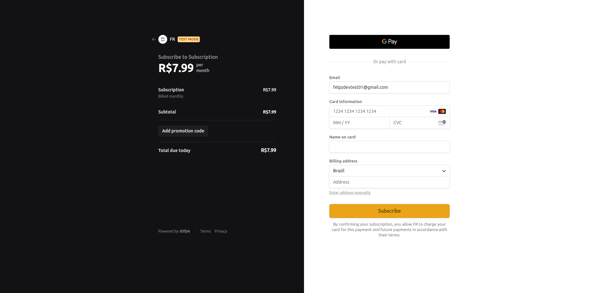

  

### :newspaper: FR.news

Application that simulates a responsive blog for fictitious law firm using NextJS, Stripe and FaunaDB.
The company name is fictitious and my idea, as well as its logo.
All applied knowledge comes from the :rocket:Rocketseat ReactJS track content of Ignite.

### :gear: Tools used:

- NextJS;
- TypeScript;
- Sass;
- Axios;
- NextAuth (signIn with Google);
- Stripe;
- FaunaDB;
- Prismic CMS;

### Some app views

## 

## 

## 
